这个项目我想要达成的目标:

1. 明白网页是如何和后端匹配在一起的
2. 明白基本的后端代码的main核心的定义的扫描规则
3. 背下一些常用标签


Springboot+Mybatis+mysql+mvc

注意它用了插件,我们还得自己去创建get和set方法


启动idea搭建项目

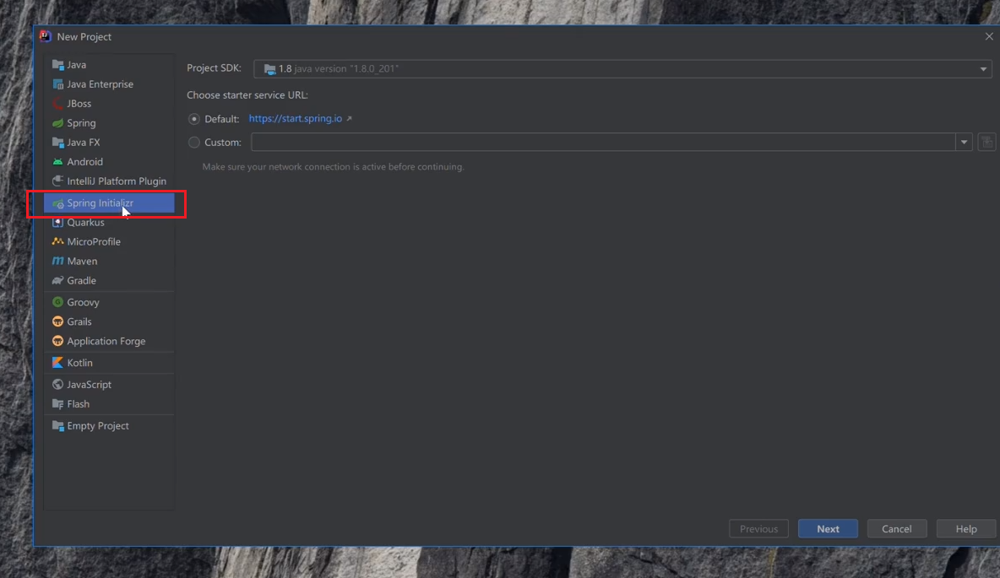

更改的常规内容(公司名,项目名,描述,包名)

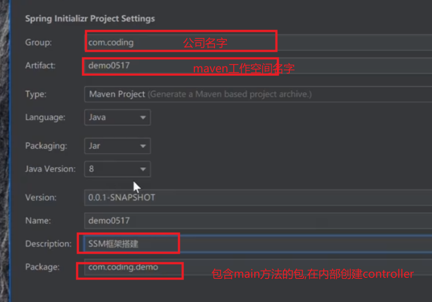

tools中的Lombook和web中的spring web(也就是我们所说的springMVC)SQL勾选其中的mybatis和mysql

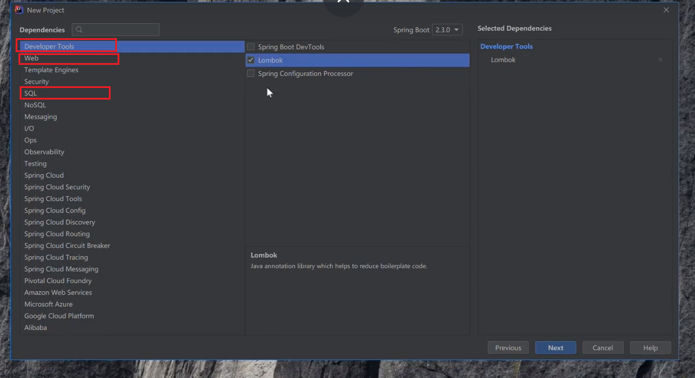

最后一步可以在项目位置处更改自己的项目名字

## 项目步骤细节

登录localhost:8080/user/login可以直接访问

以下文件在包controller下

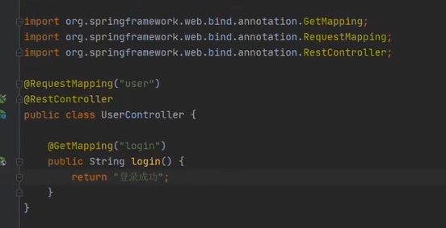


domain文件夹下User,数据库字段

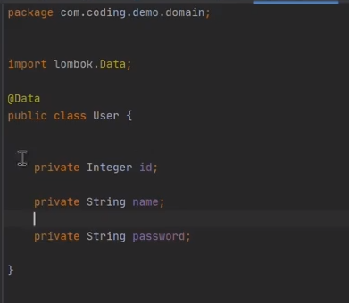


yaml文件

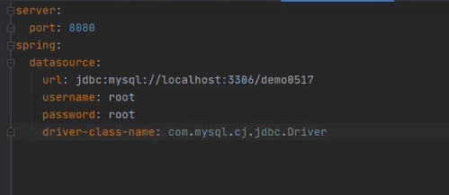修改yaml文件

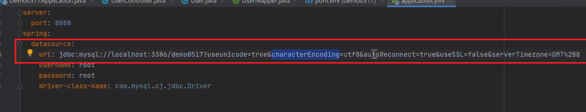

注意:url冒号后面有一个空格,yaml文件非常注意细节

```
server:
  port:8080
spring:
  datasource:
    url: jdbc:mysql://localhost:3306/test?characterEncoding=utf8&useSSL=true
    username: root
    password: zhou_19980228
    driver-class-name: com.mysql.cj.jdbc.Driver
```


## 在mapper包中创建UserMapper接口

注意细节:这里有仓库标签@Repository

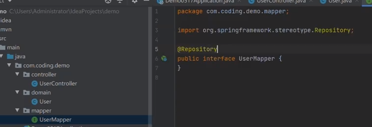


安装插件lombok

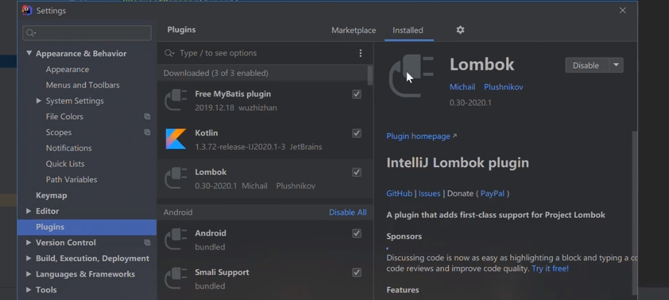

## 创建一个接口UserMapper的步骤,

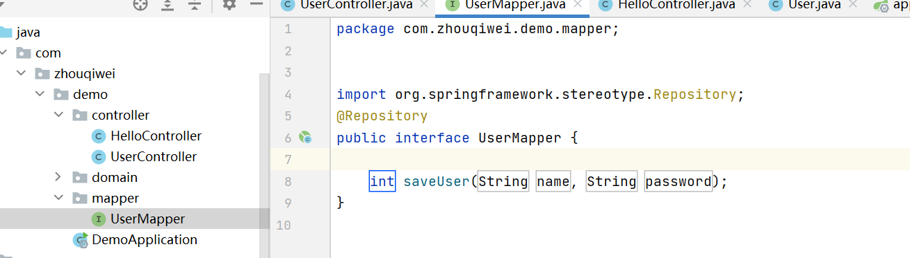


## 加入扫描对象,扫描mapper中的接口

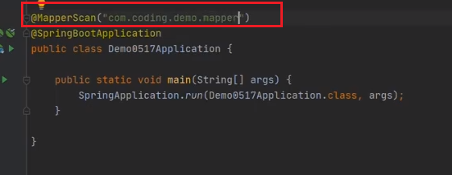

注册页面在已有的UserController中书写,并检测,输入"localhost:8080/user/register?user=周岐伟&password=123"

是否能够在后台桌面打印数据.

该步问题:lombook在这里齐了什么作用,是log.info这里插入内容吗?

注意一个细节:必须要植入标签@Slf4j

不,log.info是打印在后台上,我觉得就是起到一个少写set和get方法的作用

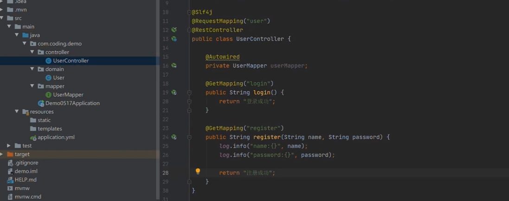

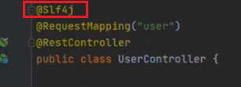

## 这里需要实例化我的接口,自动实例化我的接口利用@Autowired

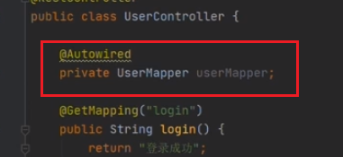

```
//关键代码
log.info("name:{}",name};
log.info("password:{}",password};
```


检测完成后增加一条代码,ctrl+鼠标左键点击saveUser进入那个接口内部

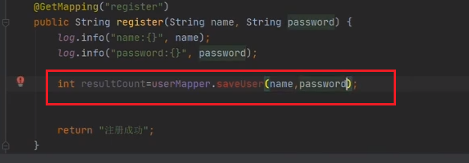

```
int resultCount=userMappper.saveUser(name,password);
```


sql插入语句可以现在sqlyog可视界面中试一遍,执行下列代码,检查插入成功,则说明sql没有问题

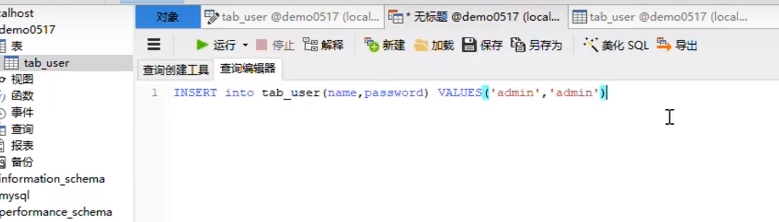


回到mapper中,替换sql中的变量语句

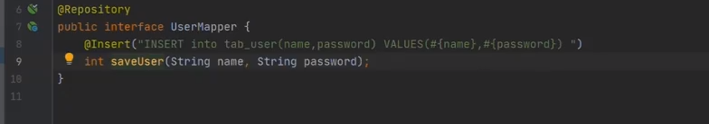

```
@Insert("INSERT INTO test(name,password) VALUES(#{NAME},#{password})")
```

安装一个插件

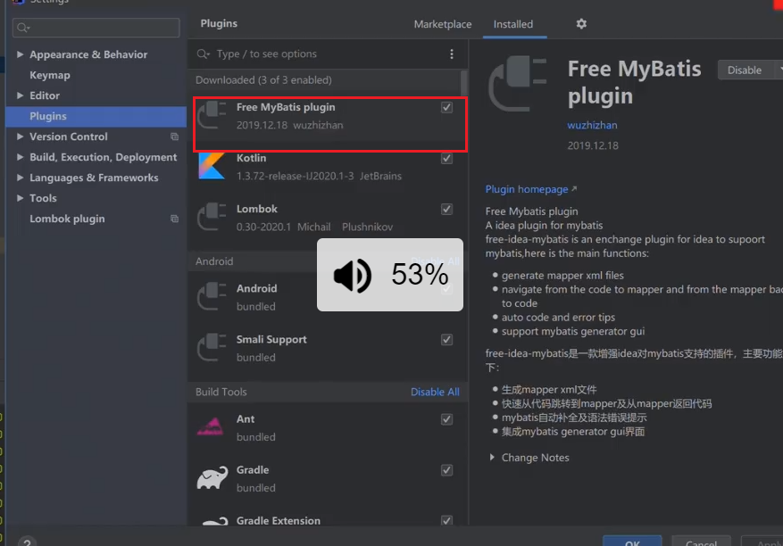

装完这个插件,选中saveUser,可以快捷生成@param

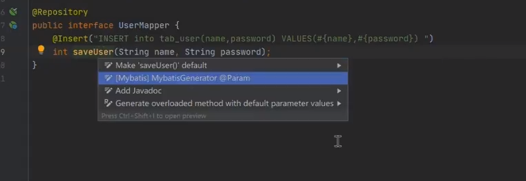

完成后效果(记忆点:@param实现替换的效果,替换上述标签查询语句中的变量)

注意插入的是数据库中表单的名字,这里将tab_user改为user

## 接口点输入与查询变量对应

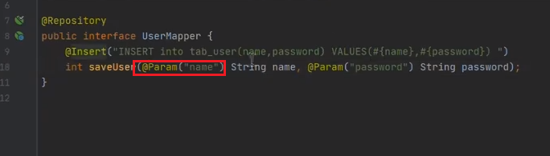


userController判断返回结果成功还是失败

```
三个注释

使用到的工具StringUtils.isEmpty()

//用户名不为空

//密码不为空

//未储存成功,返回的数字为0
```

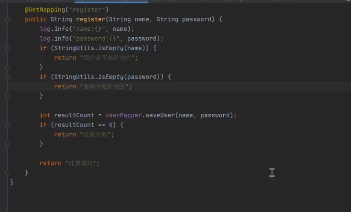

在检验前需要在main核心方法中加入扫描,注意是到接口的最小包为止

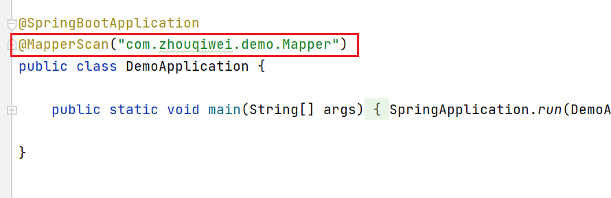


查询用户是否已经存在

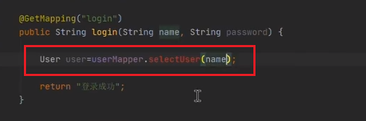	

接口UserMapper中查询语句的书写

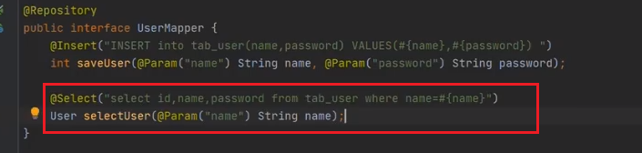

```
@Select("select id,name,password from user where name=#{name}")
```

登录验证

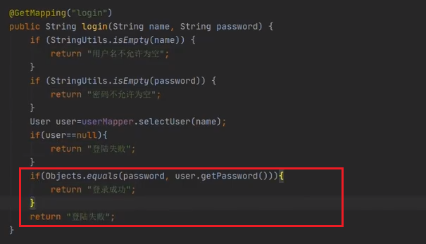

完善注册代码,防止出现两个相同用户名注册成功(先查询,如果查询出,就返回已存在)

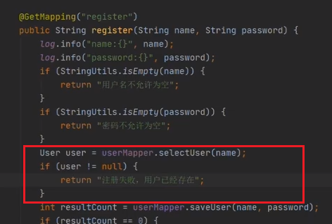

## 探究如何用curl去检测我的代码

在控制台terminal上输入:

记住在访问该网站之前就要使用get方法,(get是因为我的后台指定一定要用get方法才能访问我的这个方法)

```
curl -Get localhost:8080/user/register -d name=First -d password=someemail@someemailprovider.com 
```

这个命令类似于在浏览器内输入

```
localhost:8080/user/register?name=First&password=someemail@someemailprovider.com
```

